

# Institut Universitaire des Sciences (IUS)

## Faculté des sciences et de technologies

### Td2 - Réseau 2

### Préparé par :

**Nom : BYRON**

**Prenom : Pierre Durell Naguiby**

**Niveau : L3-Sciences Informatiques**

---

\newpage

# 1. Installation et Importation Gns3 dans une machine Virtuelle (VMware Workstation):

- ## Installation
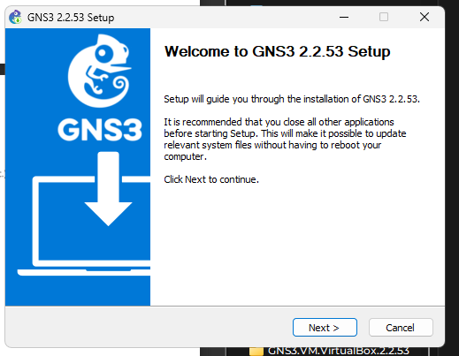
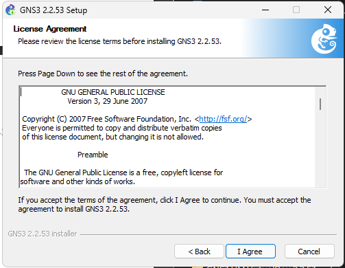
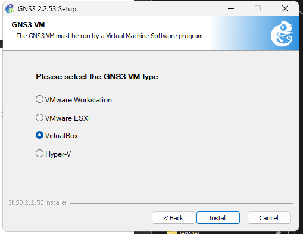
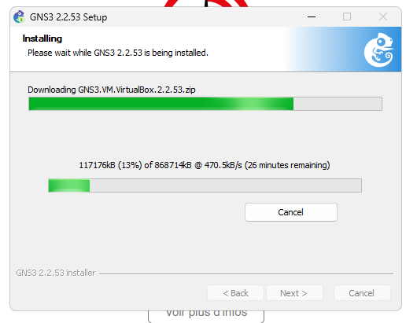
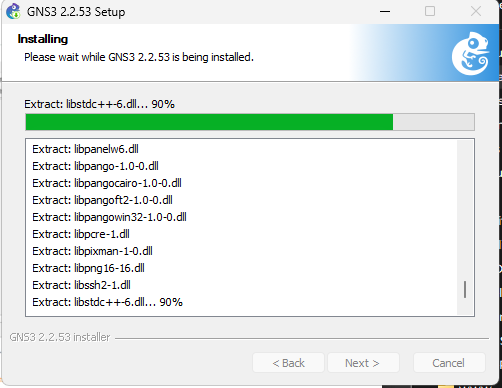
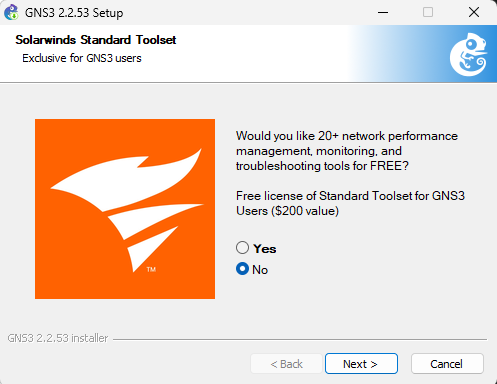

- ## Importation

---

# 2. Ajouter des images ISO pour les routeurs
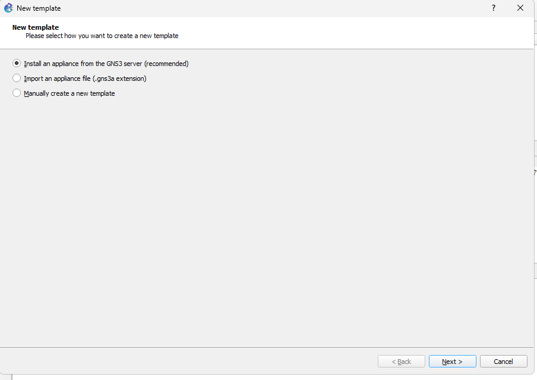
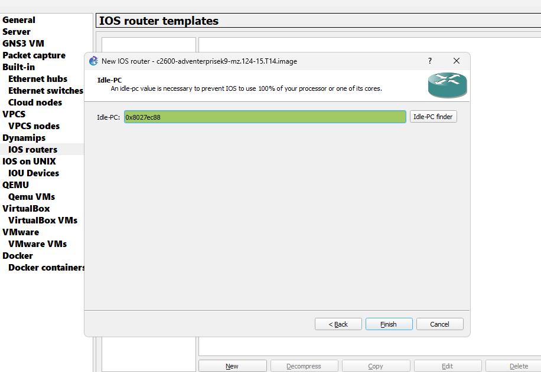
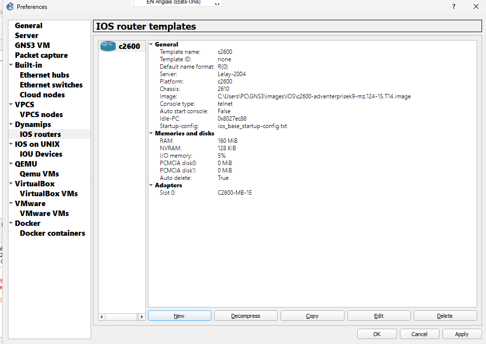
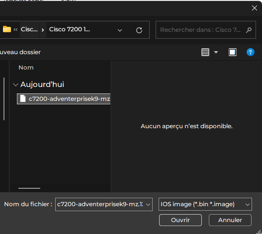
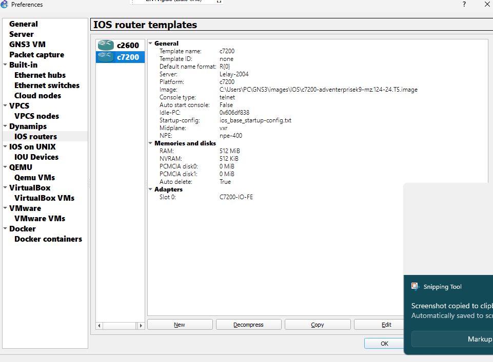

---

# 3. Reproduction de la topologie et la configuration du routeur et des PCS
---

- topologie
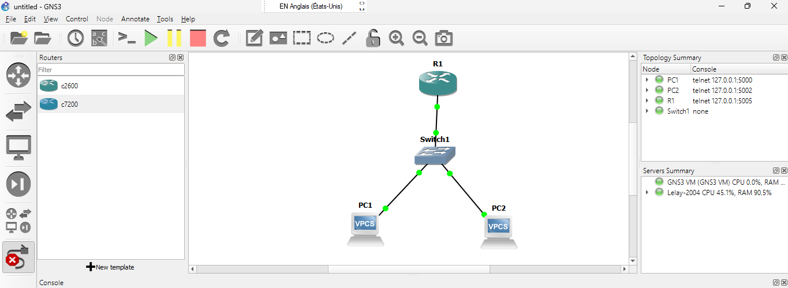

- Configuration Routeur

- configuration des PCS

    1. PC1
    

    2. PC2
    

- Test de la connexion

---

# 4. Reproduction de la topologie et la configuration du routeur et des PCS
---

- topologie
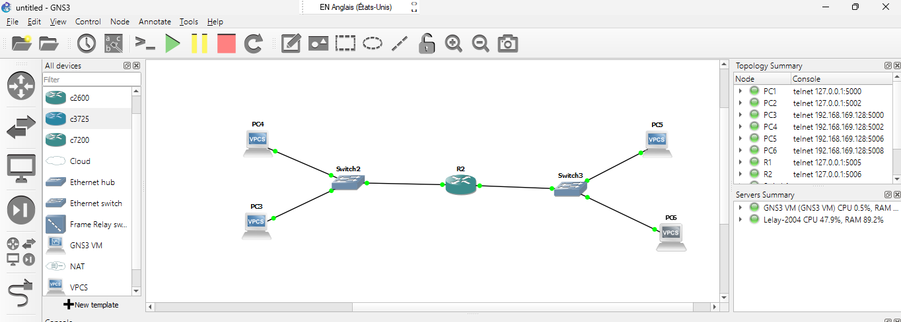

- Configuration Routeur

- configuration des PCS
    1. PC3
    

    2. PC4
    

    3. PC5
    

    4. PC6
    

---

# Conclusion :

En conclusion, ce TD me permet d'installer GNS3 et l'importer sur une marchine virtuelle (VMware Workstation), il me permet aussi d'ajouter des images de routeurs Cisco, de faire des simulations avec des topologies en configurant des routeurs et des PCS. 