# Institut Universitaire des Sciences

## Faculté des sciences et de technologies

### TD 3 Réseau 2

### Préparé par :

**Nom: BYRON**
**Prenom: Pierre Durell Naguiby**
**Niveau: L3 - Sciences Informatiques**

---

# 1. Reproduisez cette topologie en configurant le protocole Telnet.

- Topologie
    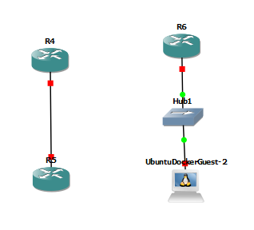{width=90%}

- configuration
    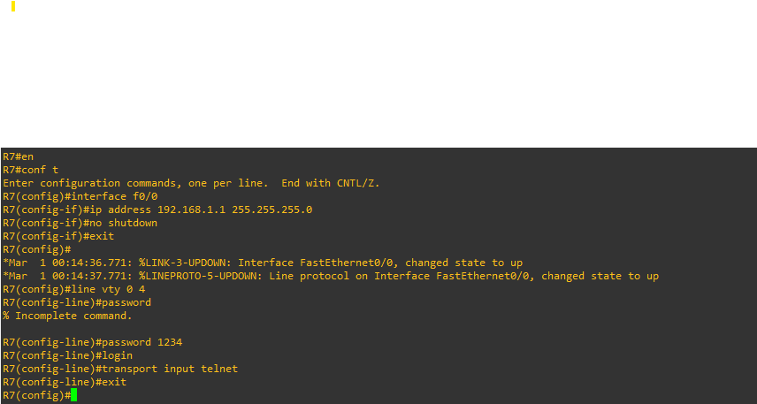{width=90%}
    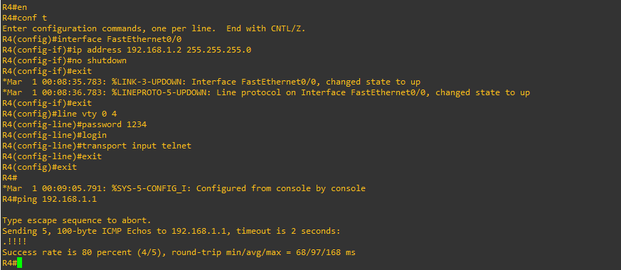{width=90%}
    {width=90%}
    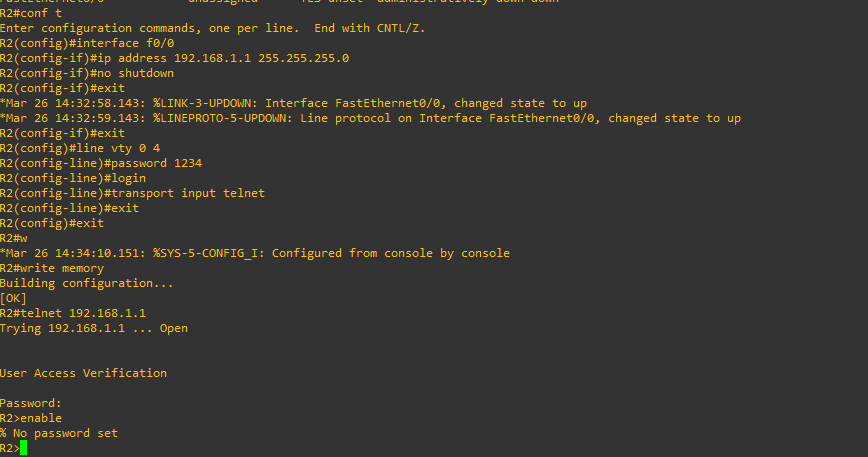{width=90%}
    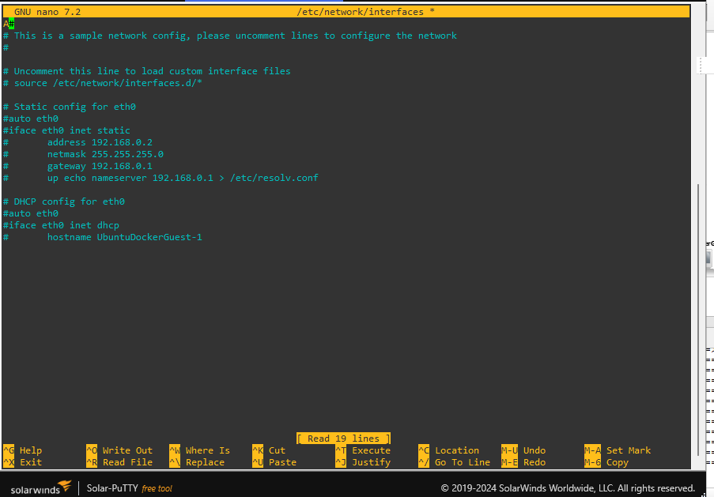{width=90%}

# 2. Reproduisez cette topologie en configurant le protocole SSH.

- Topologie
    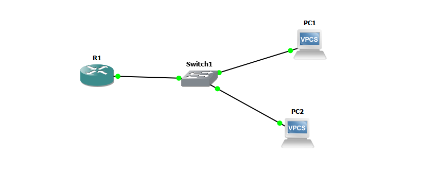{width=90%}

- configuration
    {width=90%}
    

# 3. Reproduisez cette topologie en configurant le protocole SSH.

- Topologie
    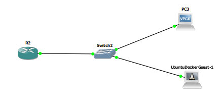{width=90%}

- configuration
    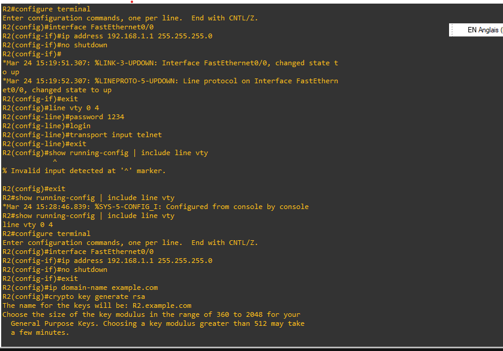{width=90%}
    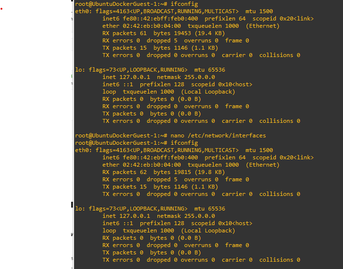{width=90%}

# 4. Reproduisez cette topologie en configurant le Serveur DNS.

- Topologie
    {width=90%}

- configuration
    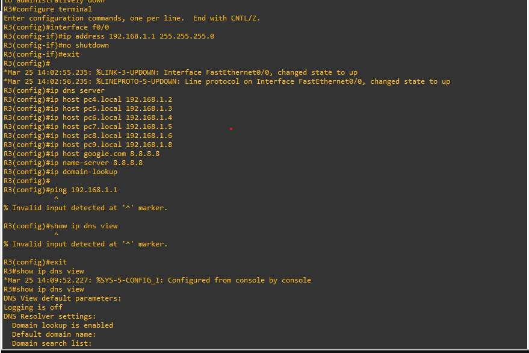{width=90%}
    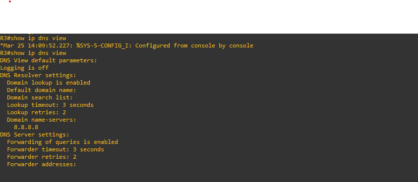{width=90%}
- Test
    {border-radius=5px}

# 5. Reproduisez cette topologie en configurant le serveur DHCP.

- Topologie
    {width=90%}

- configuration
    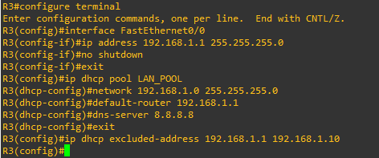{width=90%}
- Test
    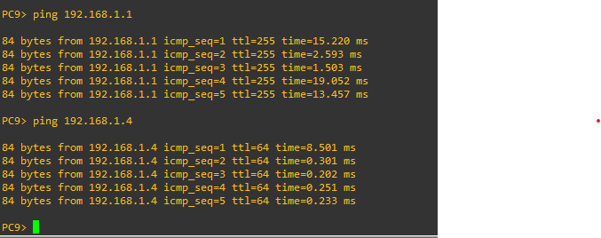{width=500px;}

# Conclusion

En conclusion, ce TD me permet de configurer et de simuler les protocoles réseaux essentiels tels que Telnet, SSH, DNS et DHCP. 

