

# Institut Universitaire des Sciences

## Faculté des sciences de technologies

### TD 4 Réseau 2

### Préparé par :

### Nom: Byron
### Prénom: Pierre Durell Naguiby
## Niveau: L3 - Sciences Informatiques

---

\newpage

# 1. Reproduisez cette topologie en configurant le NAT du réseau
{width=95%}

## Configuration nat
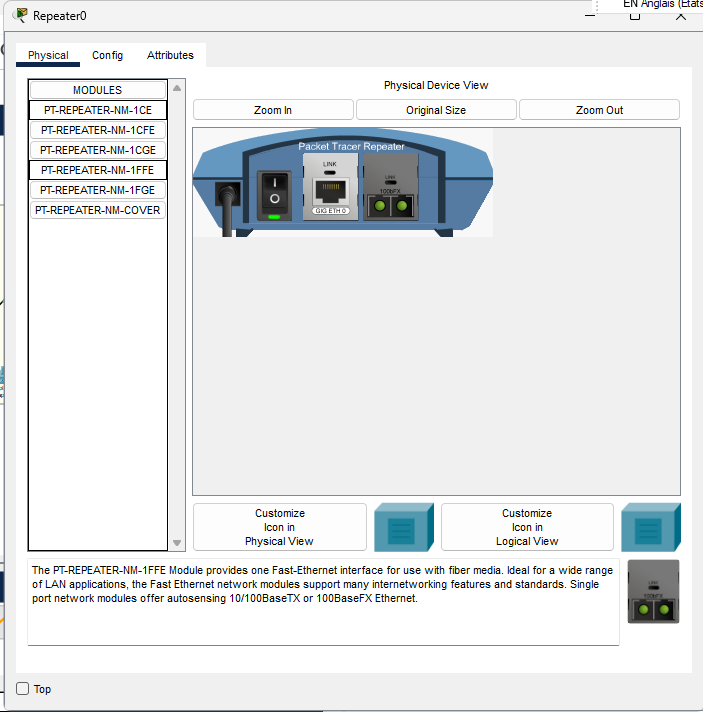{width=95%}

### DNS
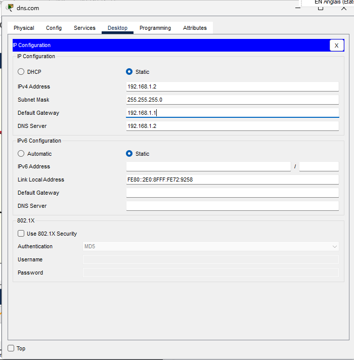{width=95%}

### Configuration du serveur DHCP sur le routeur Cisco
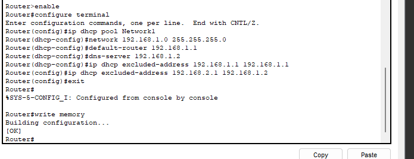{width=95%}

### Vérifications des ip
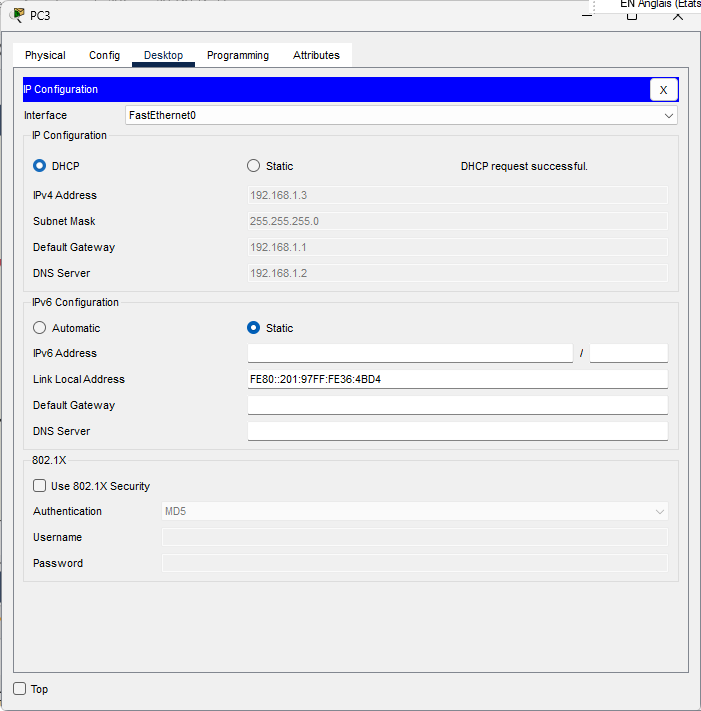{width=95%}

## Activé les services dns
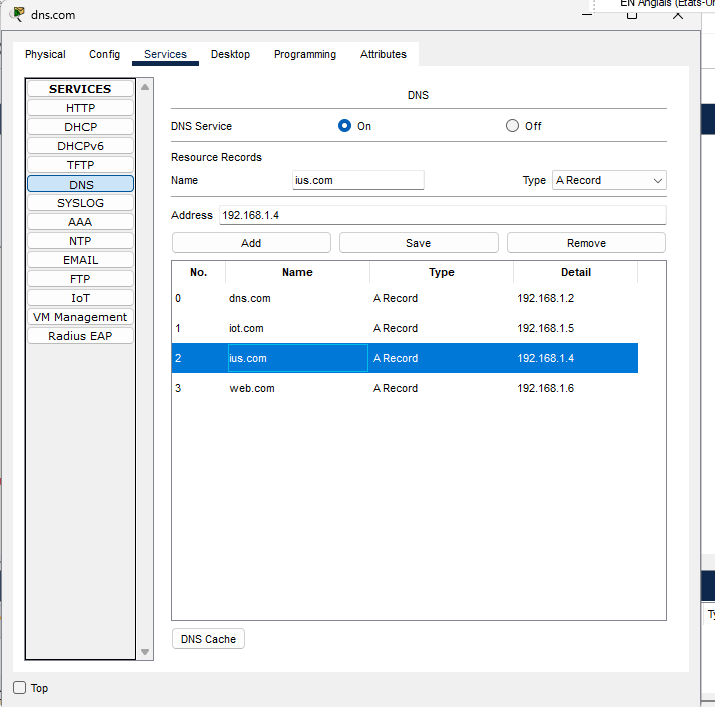{width=95%}

### Test
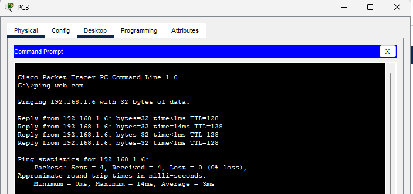{width=95%}

## Configuration de NAT sur le routeur Cisco :
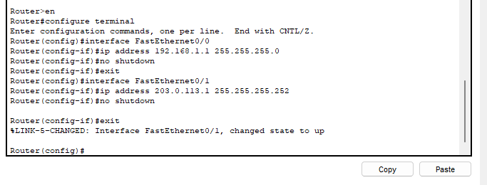{width=95%}

## Configuration de NAT dynamique (PAT) :
{width=95%}

## Test de connectivité
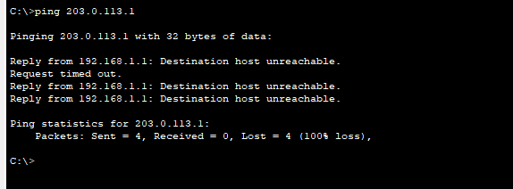{width=95%}
---
# 2. Reproduisez cette topologie en configurant le réseau IoT (Internet des Objets).
{width=95%}

## Configuration du point Acces
{width=95%}

## Activation des services IOT
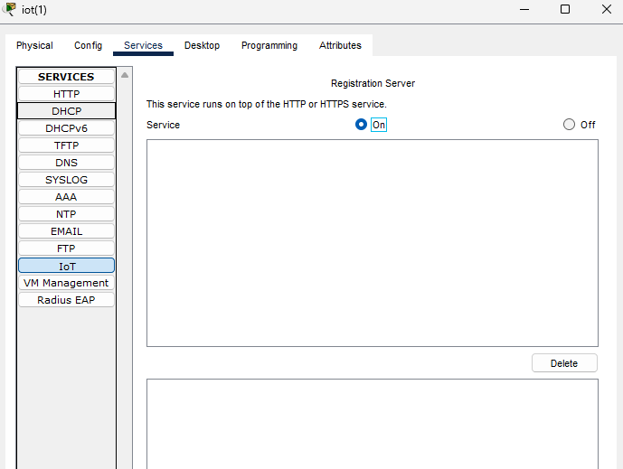{width=95%}

## Registration au server
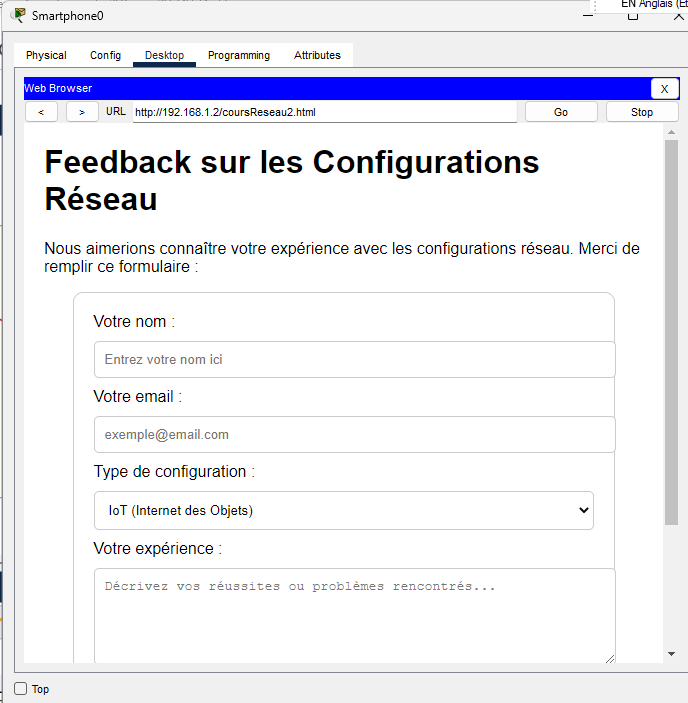{width=95%}

## Configurer les IOT

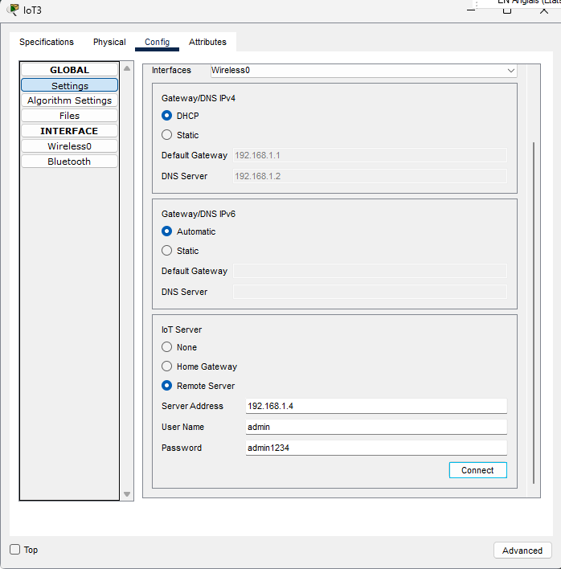{width=95%}
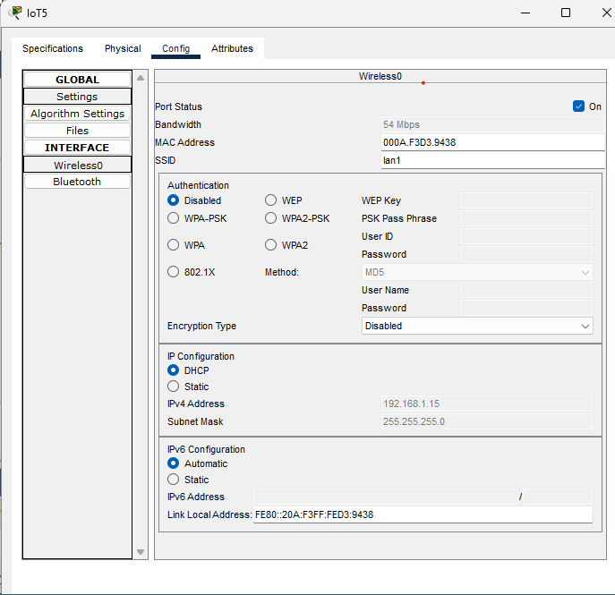{width=95%}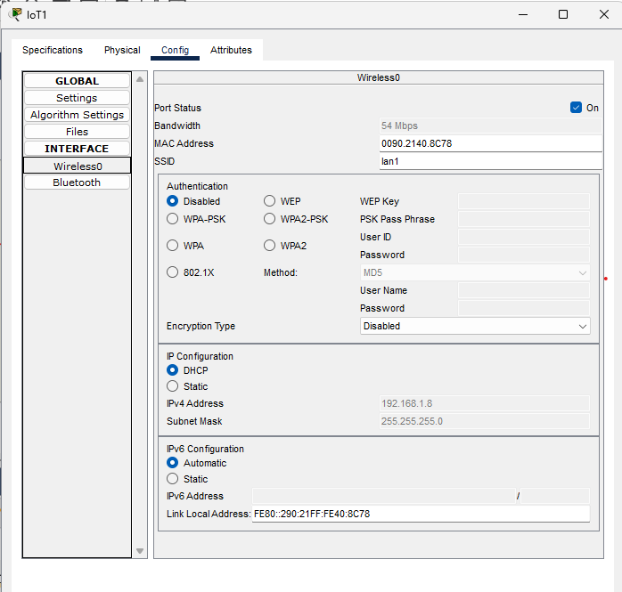{width=95%}
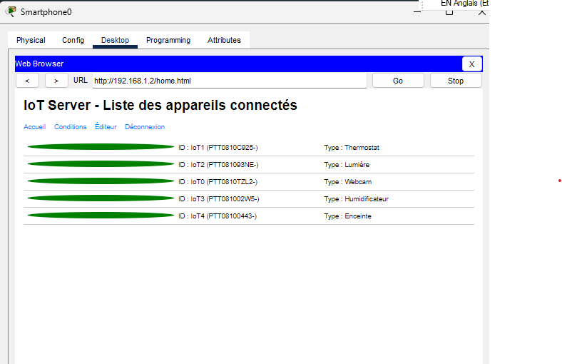{width=95%}

---

# Conclusion
En conclusion, ce TD me permet de  configurer et de simuler un réseau avec les protocoles NAT, DHCP et DNS, ainsi que les réseaux IoT.